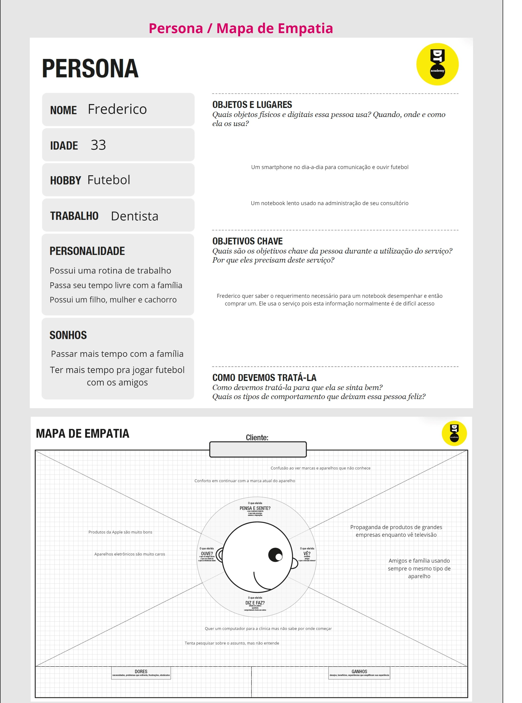
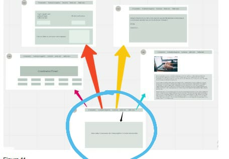
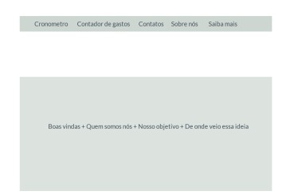
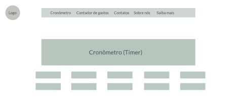
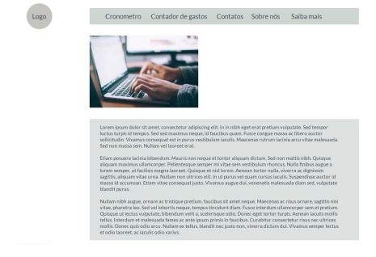
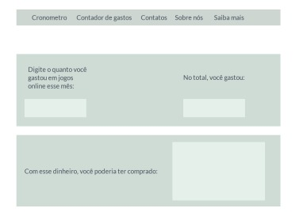

   
# Informações do Projeto
`TÍTULO DO PROJETO`  

Desinformação De Produtos Eletrônicos - 2

`CURSO` 

Ciência da Computação

## Participantes
> Os membros do grupo são: 
> - Augusto Scardua
> - Lucas Herick
> - Rikerson Antonio
> - Leonardo Silva
# Estrutura do Documento

- [Informações do Projeto](#informações-do-projeto)
  - [Participantes](#participantes)
- [Estrutura do Documento](#estrutura-do-documento)
- [Introdução](#introdução)
  - [Problema](#problema)
  - [Objetivos](#objetivos)
  - [Justificativa](#justificativa)
  - [Público-Alvo](#público-alvo)
- [Especificações do Projeto](#especificações-do-projeto)
  - [Personas e Mapas de Empatia](#personas-e-mapas-de-empatia)
  - [Histórias de Usuários](#histórias-de-usuários)
  - [Requisitos](#requisitos)
    - [Requisitos Funcionais](#requisitos-funcionais)
    - [Requisitos não Funcionais](#requisitos-não-funcionais)
  - [Restrições](#restrições)
- [Projeto de Interface](#projeto-de-interface)
  - [User Flow](#user-flow)
  - [Wireframes](#wireframes)
- [Metodologia](#metodologia)
  - [Divisão de Papéis](#divisão-de-papéis)
  - [Ferramentas](#ferramentas)
  - [Controle de Versão](#controle-de-versão)
- [**############## SPRINT 1 ACABA AQUI #############**](#-sprint-1-acaba-aqui-)
- [Projeto da Solução](#projeto-da-solução)
  - [Tecnologias Utilizadas](#tecnologias-utilizadas)
  - [Arquitetura da solução](#arquitetura-da-solução)
- [Avaliação da Aplicação](#avaliação-da-aplicação)
  - [Plano de Testes](#plano-de-testes)
  - [Ferramentas de Testes (Opcional)](#ferramentas-de-testes-opcional)
  - [Registros de Testes](#registros-de-testes)
- [Referências](#referências)

# Introdução

## Problema

Na área de hardware de eletrônicos há dificuldade de compreender as qualidades dos produtos, e, por consequência a aplicabilidade destes. Isso causa mal uso de dinheiro em muitas ocasiões, seja por falta ou excesso de capacidade de processamento, por custo de energia, ou por outros diversos motivos.

## Objetivos

A meta deste projeto é resolver o problema da incapacidade de identificar o hardware adequado para indivíduos de duas formas, a primeira através de indicação de diferentes qualidades do produto e a segunda disponibilizando as informações necessárias para discernir a utilidade do produto.

## Justificativa

É comum a situação de ter que ajudar um familiar, normalmente mais velho, a escolher um computador ou outro equipamento eletrônico e isso reflete o problema comum anteriormente elaborado assim como no questionário que aplicamos. Resolver este problema pode poupar dinheiro e tempo na vida das pessoas, dois recursos escassos e inestimáveis em muitos casos.

## Público-Alvo

O público alvo é composto de indivíduos leigos em tecnologia que querem comprar produtos eletrônicos sem precisar de conhecimento técnico e daqueles que querem adquirir tal conhecimento para uso próprio. 

A persona acima demonstra um perfil muito comum, pessoas de idade entre 30 e 50 anos que precisam adquirir um eletrônico, seja para trabalho ou uso privado, mas têm dificuldade de escolher um produto adequado.

 
# Especificações do Projeto
Utilizando o design thinking o projeta a seguir foi abordado pensando no público alvo, nos sentimentos, nas dúvidas e nos contextos das personas.

## Personas e Mapas de Empatia

......  COLOQUE AQUI O SEU TEXTO ......

## Histórias de Usuários

Com base na análise das personas forma identificadas as seguintes histórias de usuários:

|EU COMO... `PERSONA`      |     QUERO/PRECISO ... `FUNCIONALIDADE`      |             PARA ... `MOTIVO/VALOR`            |
|--------------------------|---------------------------------------------|------------------------------------------------|
| Leigo em tecnologia      | Comprar um eletrônico                       | Exercer funções administrativas no meu negócio |
| Entusiasta de tecnologia | Aprender sobre as qualidades de componentes | Ser capaz de fazer compras bem informadas      |

## Requisitos

As tabelas que se seguem apresentam os requisitos funcionais e não funcionais que detalham o escopo do projeto.

### Requisitos Funcionais

|ID    | Descrição do Requisito                                                | Prioridade |
|------|-----------------------------------------------------------------------|------------|
|RF-001| Fornecer informação acessível e util sobre a qualidade de eletrônicos | ALTA       | 
|RF-002| Fornecer informação sobre aspectos técnicos de eletrônicos            | MÉDIA      |

### Requisitos não Funcionais

|ID     | Descrição do Requisito  |Prioridade |
|-------|-------------------------|----|
|RNF-001| O sistema deve ser responsivo para rodar em um dispositivos móvel | MÉDIA | 
|RNF-002| Deve processar requisições do usuário em no máximo 3s |  BAIXA | 

## Restrições

O projeto está restrito pelos itens apresentados na tabela a seguir.

|ID| Restrição                                             |
|--|-------------------------------------------------------|
|01| O projeto deverá ser entregue até o final do semestre |
|02| Não pode ser desenvolvido um módulo de backend        |

# Projeto de Interface

A pagina deve conter uma página inicial, com uma sessão de produtos novos e produtos em alta e além disso deve conter outras duas.
A primeira será de produtos classificados por uma qualidade (durabilidade, future-proofing, capacidade de processamento etc).
A segunda será de produtos classificados por marca e modelo, modelos devem conter também suas notas nas qualidades especificadas.
Toda página deve ter um link com informações e fontes sobre critérios utilizados para determinar as qualidades dos produtos, com elaboração a fundo destes critérios.
Toda página deve conter um menu de navegação no cabeçalho de levas às outras páginas citadas, e também uma de contados e informações.

## User Flow

## Wireframes

Página inicial

Página de produtos por modelo

Página de produtos por qualidade

Página de informações

# Metodologia

Inicialmente utilizamos o Design Thinking para entender o problema de maneira mais profunda e as pessoas/entidades que são relevantes, através das personas adiquirimos o perfil dos usuários e com o brainstorm divisamos ideias que poderiam ser úteis no segundo estágio, para ter mais agilidade no processo de comunicação utilizamos o Miro.
Aplicando user flow e wireframes entendemos as necessidades do site e sua estrutura básica, para criar ambos foi usado o mockplus.
Todo o processo foi feito no Github, compartilhando possíveis modificações do projeto e aprovando aquelas que foram mais apropriadas.

## Divisão de Papéis

Scrum master: Rikerson
Product Owner: Augusto
Time: Rikerson, Augusto, Leonardo

## Ferramentas

Discord: Um ambiente já utilizado por todos se demonstra prático, a qualidade das chamadas de voz para reuniões também é um atrativo.
Miro: A plataforma apresenta um serviço altamente útil e ágil, ideal para compartilhar as idéias e concretiza-las.
GitHub: Extremamente útil para o controle de versão do produto a plataforma oferece ótimas funções para trabalhos em grupo.

| Ambiente  | Plataforma              |Link de Acesso |
|-----------|-------------------------|---------------|
|Comunicação| Discord                |https://https://discord.com/|
|Processo de Design Thinkgin  | Miro |  https://miro.com/XXXXXXX | 
|Repositório de código | GitHub | https://github.com/XXXXXXX | 
|Hospedagem do site | Heroku |  https://XXXXXXX.herokuapp.com | 
|Protótipo Interativo | MavelApp ou Figma | https://figma.com/XXXXXXX | 

## Controle de Versão

Os contribuidores do projeto usaram a função de pull request para ter pontos de vista diferentes aplicados e possívelmente fazer um commit sobre o contéudo quando as ideias se concretizaram

# **############## SPRINT 1 ACABA AQUI #############**

# Projeto da Solução

......  COLOQUE AQUI O SEU TEXTO ......

## Tecnologias Utilizadas

......  COLOQUE AQUI O SEU TEXTO ......

> Descreva aqui qual(is) tecnologias você vai usar para resolver o seu
> problema, ou seja, implementar a sua solução. Liste todas as
> tecnologias envolvidas, linguagens a serem utilizadas, serviços web,
> frameworks, bibliotecas, IDEs de desenvolvimento, e ferramentas.
> Apresente também uma figura explicando como as tecnologias estão
> relacionadas ou como uma interação do usuário com o sistema vai ser
> conduzida, por onde ela passa até retornar uma resposta ao usuário.
> 
> Inclua os diagramas de User Flow, esboços criados pelo grupo
> (stoyboards), além dos protótipos de telas (wireframes). Descreva cada
> item textualmente comentando e complementando o que está apresentado
> nas imagens.
## Arquitetura da solução

......  COLOQUE AQUI O SEU TEXTO E O DIAGRAMA DE ARQUITETURA .......

> Inclua um diagrama da solução e descreva os módulos e as tecnologias
> que fazem parte da solução. Discorra sobre o diagrama.
> 
> **Exemplo do diagrama de Arquitetura**:
> 
> 

# Avaliação da Aplicação

......  COLOQUE AQUI O SEU TEXTO ......

> Apresente os cenários de testes utilizados na realização dos testes da
> sua aplicação. Escolha cenários de testes que demonstrem os requisitos
> sendo satisfeitos.
## Plano de Testes

......  COLOQUE AQUI O SEU TEXTO ......

> Enumere quais cenários de testes foram selecionados para teste. Neste
> tópico o grupo deve detalhar quais funcionalidades avaliadas, o grupo
> de usuários que foi escolhido para participar do teste e as
> ferramentas utilizadas.
> 
> **Links Úteis**:
> - [IBM - Criação e Geração de Planos de Teste](https://www.ibm.com/developerworks/br/local/rational/criacao_geracao_planos_testes_software/index.html)
> - [Práticas e Técnicas de Testes Ágeis](http://assiste.serpro.gov.br/serproagil/Apresenta/slides.pdf)
> -  [Teste de Software: Conceitos e tipos de testes](https://blog.onedaytesting.com.br/teste-de-software/)
## Ferramentas de Testes (Opcional)

......  COLOQUE AQUI O SEU TEXTO ......

> Comente sobre as ferramentas de testes utilizadas.
> 
> **Links Úteis**:
> - [Ferramentas de Test para Java Script](https://geekflare.com/javascript-unit-testing/)
> - [UX Tools](https://uxdesign.cc/ux-user-research-and-user-testing-tools-2d339d379dc7)
## Registros de Testes

......  COLOQUE AQUI O SEU TEXTO ......

> Discorra sobre os resultados do teste. Ressaltando pontos fortes e
> fracos identificados na solução. Comente como o grupo pretende atacar
> esses pontos nas próximas iterações. Apresente as falhas detectadas e
> as melhorias geradas a partir dos resultados obtidos nos testes.

# Referências

......  COLOQUE AQUI O SEU TEXTO ......

> Inclua todas as referências (livros, artigos, sites, etc) utilizados
> no desenvolvimento do trabalho.
> 
> **Links Úteis**:
> - [Formato ABNT](https://www.normastecnicas.com/abnt/trabalhos-academicos/referencias/)
> - [Referências Bibliográficas da ABNT](https://comunidade.rockcontent.com/referencia-bibliografica-abnt/)
© 2022 GitHub, Inc.
Terms
Privacy
Security
Status
Docs
Contact GitHub
Pricing
API
Training
Blog
About
